# FOLIO Application Registry (FAR) Terraform Module

## Table of Contents

- [Overview](#overview)
- [Architecture](#architecture)
- [Prerequisites](#prerequisites)
- [Required Variables](#required-variables)
- [Usage](#usage)
- [Recovery Procedures](#recovery-procedures)

## Overview

This Terraform module deploys the FOLIO Application Registry (FAR) infrastructure on AWS EKS with Rancher. It provisions
a PostgreSQL database with durable EBS storage, automated backups, and the MGR Applications service in FAR mode.

## Architecture

The infrastructure consists of:

- Rancher project and Kubernetes namespace
- AWS EBS volume with daily snapshots (180-day retention)
- PostgreSQL database deployed via Helm
- MGR Applications service in FAR mode
- Secure credential management with AWS Secrets Manager



## Prerequisites

- AWS CLI configured with appropriate permissions
- Terraform v1.6.1+
- Access to an EKS cluster
- Rancher API token
- `kubectl` configured for the target cluster

## Required Variables

| Variable             | Description                         | Type   | Required                           |
|----------------------|-------------------------------------|--------|------------------------------------|
| `cluster_name`       | EKS cluster name                    | string | Yes                                |
| `namespace_name`     | Kubernetes namespace name           | string | Yes                                |
| `domain_name`        | Domain name for the application     | string | No, defaults to `far.ci.folio.org` |
| `aws_region`         | AWS region for resources            | string | Yes                                |
| `rancher_server_url` | Rancher API URL                     | string | Yes                                |
| `rancher_token_key`  | Rancher API token                   | string | Yes                                |
| `chart_version`      | MGR Applications Helm chart version | string | Yes                                |

For a complete list of variables, see the `variables.tf` file.

## Usage

1. **Initialize Terraform**
   ```bash
   terraform init
   ```

2. **Configure Variables**
   Create a `terraform.tfvars` file:
   ```hcl
   cluster_name      = "my-eks-cluster"
   namespace_name    = "far"
   domain_name       = "far.ci.folio.org"
   aws_region        = "us-west-2"
   rancher_server_url = "https://rancher.example.com"
   rancher_token_key = "token-xxxxx"
   chart_version     = "3.0.2"
   ```

3. **Review Plan**
   ```bash
   terraform plan -input=false -out tfplan
   ```

4. **Apply Configuration**
   ```bash
   terraform apply -input=false tfplan
   ```

5. **Verify Deployment**
   ```bash
   kubectl get pods -n far
   ```

## Recovery Procedures

For disaster recovery scenarios, refer to:
- [Recovery Procedures Documentation](./RECOVERY.md)

These documents cover various failure scenarios including:

- EBS volume or Kubernetes infrastructure loss
- PostgreSQL StatefulSet deletion
- MGR Application deployment deletion
- Credential loss 