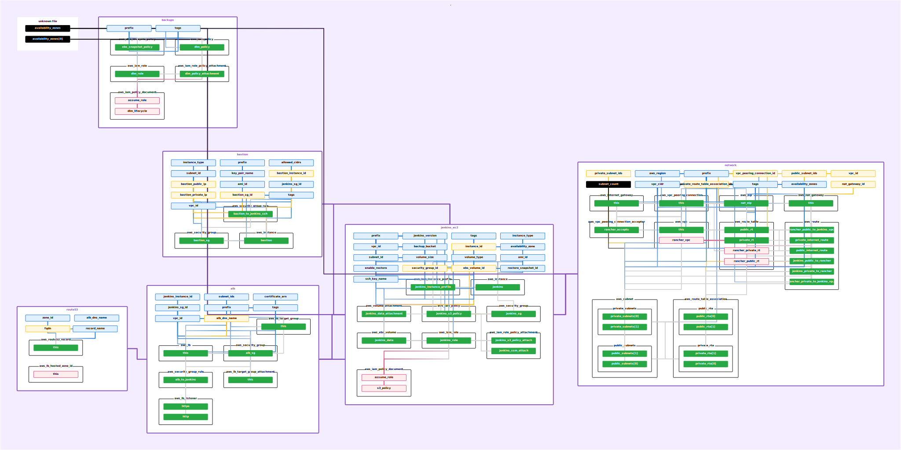

# Jenkins Infrastructure

> **_NOTE:_**
> Before commit changes in scripts do not forget to format and validate
> ```shell
> terraform fmt
> terraform validate
> ```

This Terraform module provisions the **entire Jenkins infrastructure**, including networking, compute resources, and backups.


## **📌 Table of Contents**
- [Features](#features)
- [Prerequisites](#prerequisites)
- [Install](#install)
- [Destroy](#destroy)
- [Usage as a Module](#usage-as-a-module)
- [Inputs](#inputs)
- [Outputs](#outputs)
- [Upgrade Jenkins Version](#upgrade-jenkins-version)
- [Graph](#graph)
- [Post-Deployment Steps](#post-deployment-steps)

## **Features**

- **Creates a VPC** with public and private subnets
- **Deploys Jenkins on EC2** with an attached EBS volume
- **Sets up an ALB (Application Load Balancer)** with HTTPS support
- **Configures Route53 DNS records** for Jenkins
- **Creates a Bastion host** for secure SSH access
- **Automates Jenkins backups** to an S3 bucket
- **Supports EBS volume restoration** from a snapshot

## **Prerequisites**

- Terraform >= 1.6.1
- AWS provider configured with appropriate permissions
- Route53 Hosted Zone for domain mapping (optional)
- IAM role for Jenkins EC2 to access backups in S3

## **Install**

Set variables in `terraform.tfvars` (Recommended):

```hcl
prefix                = "folio"
region                = "us-west-2"
vpc_cidr              = "192.168.0.0/16"
public_subnet_cidr    = "192.168.0.0/24"
private_subnet_cidr   = "192.168.1.0/24"
ami_id                = "ami-0005ee01bca55ab66"
instance_type         = "m7a.xlarge"
bastion_instance_type = "t3.micro"
ssh_key_name          = "FolioJenkins"
volume_size           = 500
enable_restore        = false
restore_snapshot_id   = ""
jenkins_version       = "2.492.1"
backup_bucket         = "my-jenkins-backups"
route53_zone_id       = "ZXXXXXXXXXXXXXX"
route53_record_name   = "jenkins.ci.folio.org"
certificate_arn       = "arn:aws:acm:us-west-2:account-id:certificate/certificate-id"
allowed_cidrs         = ["0.0.0.0/0"]
tags                  = {
  Terraform = "true",
  Team      = "kitfox",
  Project   = "folio"
}
```

```shell
terraform init
terraform plan -input=false -out tfplan
terraform apply -input=false tfplan
```
## **Destroy**
```shell
terraform destroy -auto-approve
```

## **Usage as a Module**

```hcl
module "root" {
  source               = "./path-to-root-module"
  prefix               = "folio"
  region               = "us-west-2"
  vpc_cidr             = "10.0.0.0/16"
  public_subnet_cidr   = "10.0.0.0/24"
  private_subnet_cidr  = "10.0.1.0/24"
  ami_id               = "ami-xxxxxxxxxxxx"
  instance_type        = "t3.medium"
  bastion_instance_type = "t3.micro"
  ssh_key_name         = "my-key-pair"
  volume_size          = 50
  enable_restore       = false
  restore_snapshot_id  = ""
  jenkins_version      = "2.387.2"
  backup_bucket        = "my-jenkins-backups"
  route53_zone_id      = "ZXXXXXXXXXXXXXX"
  route53_record_name  = "jenkins.example.com"
  certificate_arn      = "arn:aws:acm:us-west-2:account-id:certificate/certificate-id"
  allowed_cidrs        = ["0.0.0.0/0"]
  tags                 = { Team = "kitfox" }
}
```

## **Inputs**

| Name                  | Description                                        | Type         | Default | Required |
|-----------------------|----------------------------------------------------|-------------|---------|----------|
| `prefix`             | Prefix for naming AWS resources                    | `string`    | n/a     | yes      |
| `region`             | AWS region for resource deployment                 | `string`    | n/a     | yes      |
| `vpc_cidr`           | CIDR block for the VPC                             | `string`    | n/a     | yes      |
| `public_subnet_cidr` | CIDR block for the public subnet                   | `string`    | n/a     | yes      |
| `private_subnet_cidr`| CIDR block for the private subnet                  | `string`    | n/a     | yes      |
| `ami_id`             | AMI ID for Jenkins EC2 instance                    | `string`    | n/a     | yes      |
| `instance_type`      | EC2 instance type for Jenkins                      | `string`    | `"t3.medium"` | no |
| `bastion_instance_type` | EC2 instance type for Bastion host              | `string`    | `"t3.micro"` | no |
| `ssh_key_name`       | SSH key pair name for accessing instances           | `string`    | n/a     | yes      |
| `volume_size`        | Size of the Jenkins EBS volume (GB)                 | `number`    | `50`    | no       |
| `enable_restore`     | Whether to restore from an EBS snapshot             | `bool`      | `false` | no       |
| `restore_snapshot_id` | Snapshot ID for restoring the EBS volume          | `string`    | `""`    | no       |
| `jenkins_version`    | Jenkins version to install                          | `string`    | `"latest"` | no |
| `backup_bucket`      | S3 bucket name for storing Jenkins backups          | `string`    | n/a     | yes      |
| `route53_zone_id`    | Route53 Hosted Zone ID                              | `string`    | n/a     | yes      |
| `route53_record_name`| Fully qualified domain name for Jenkins             | `string`    | n/a     | yes      |
| `certificate_arn`    | ARN of the SSL certificate for ALB                  | `string`    | n/a     | yes      |
| `allowed_cidrs`      | CIDR blocks allowed to access the Bastion           | `list(string)` | `[]` | no       |
| `tags`               | Additional tags for AWS resources                   | `map(any)`  | `{}`    | no       |

## **Outputs**

| Name                  | Description                                      |
|----------------------|------------------------------------------------|
| `vpc_id`            | ID of the deployed VPC                          |
| `jenkins_instance_id` | ID of the Jenkins EC2 instance                 |
| `alb_dns_name`       | DNS name of the ALB                             |
| `route53_fqdn`       | Fully qualified domain name for Jenkins         |
| `bastion_instance_id`| ID of the Bastion EC2 instance                  |

## **Upgrade Jenkins version**
1. Check release notes for the latest Jenkins version [here](https://www.jenkins.io/changelog/)
2. Stop Jenkins service
```shell
sudo systemctl stop jenkins
```
3. Backup current Jenkins binaries
```shell
sudo mv /usr/share/java/jenkins.war /usr/share/java/jenkins.war.bak
```
4. Download the new Jenkins version
```shell
cd /usr/share/java
wget https://get.jenkins.io/war-stable/${version}/jenkins.war
```
5. Start Jenkins service
```shell
sudo systemctl start jenkins
```
6. Login to UI and check that new version is installed
7. Navigate to Jenkins -> Manage Jenkins -> Manage Plugins -> Updates and install the latest plugins
8. If all is working fine, delete the old Jenkins binaries
```shell
sudo rm /usr/share/java/jenkins.war.bak
```

## **Graph**



## **Post-Deployment Steps**

[Configure Jenkins Kubernetes Cloud](./jenkins-agents.md)